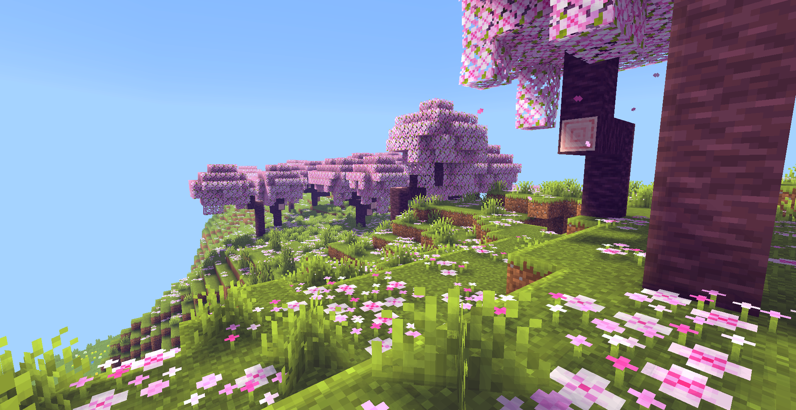

A lightweight gameplay focused shader pack for Minecraft Java Edition

This pack is Iris only

This pack is in Beta and will be broken in a lot of cases. Use with caution.

<h2 align="center">Features</h2>

* Very fast and lightweight

* Custom penumbra shadows with a lot of settings
* Colord lighting based on daytime
* Settings for torch light color
* Better weather, with lots of settings to play around with
* Custom fog for the overworld
* Seasons
* Simple camera effects
* Waving leaves and foliage
* Color settings to change the look and feel of your game
* EXPERIMENTAL: Waving Water, defaults to disabled

<h2 align="center">Install</h2>

* Step 1: Download As Zip
* Step 2: Extract the zip
* Step 3: Move the subfolder to your shaders folder
* Step 4: Start Minecraft
* Step 5: Select the shader
* Step 6: ...Enjoy!

<h2 align="center">Acknowledgments</h2>

* Thank you to <a href="https://github.com/X0nk">Xonk</a> for his season code
* Thank you to all of the lovely people in the <a href="https://discord.com/invite/RpzWN9S">ShaderLABS discord</a> who helped make this shader a reality.
* Shoutout to <a href="https://github.com/X0nk">Xonk</a>, <a href="https://github.com/IMS212">IMS</a>, <a href="https://www.youtube.com/@timetravelbeard3588">Timetravelbeard</a>, <a href="https://github.com/BalintCsala">Bálint</a>, <a href="https://github.com/ninjamike1211">NinjaMike</a>, <a href="https://github.com/null511">Null</a>, and <a href="https://github.com/Builderb0y">Builderb0y</a> for all of their help fixing bugs and providing suggestions to make this shader what it is.

<h2 align="center">Community</h2>

Come join us in the <a href="https://discord.com/invite/RpzWN9S">ShaderLABS discord</a>
